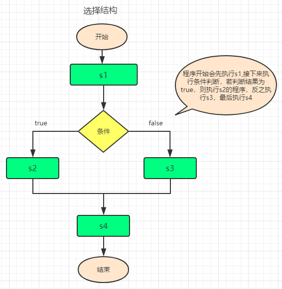

<h1 align="center">day01</h1>

### 一、计算机特点是什么 ?

1、计算机是一种电器, 所以计算机只能识别两种状态, **一种是通电一种是断电**

2、正是因为如此, 最初ENIAC的程序是由很多开关和连接电线来完成的。但是这样导致**改动一次程序要花很长时间**(需要人工重新设置很多开关的状态和连接线)


3、为了提高效率,工程师们想能不能把程序和数据都放在存储器中, 数学家冯·诺依曼将这个思想以数学语言系统阐述，提出了存储程序计算机模型(这是所谓的冯·诺依曼机)


4、那利用数学语言如何表示计算机能够识别的通电和断电两种状态呢?

- **非常简单用0和1表示即可**
- **所以计算机能识别的所有指令都是由0和1组成的**
- **所以计算机中存储和操作的数据也都是由0和1组成的**


### 二、什么是计算机程序 ?

计算机程序是为了告诉计算机"做某件事或解决某个问题"而用"**计算机语言**编写的命令集合(语句)

只要让计算机执行这个程序,计算机就会自动地、有条不紊地进行工作,计算机的一切操作都是由程序控制的,离开程序,计算机将一事无成

现实生活中你如何告诉别人如何做某件事或者解决某个问题?

- 通过人能听懂的语言: 哥们儿，我好像看到你女朋友和他前男友在一起？
- 其实我们通过人能听懂的语言告诉别人做某件事就是在发送一条条的指令
- 计算机中也一样, 我们可以通过计算机语言告诉计算机我们想做什么, 每做一件事情就是一条指令, 一条或多条指令的集合我们就称之为一个计算机程序


### 三、什么计算机语言 ?

在日常生活、工作中, 语言是人们交流的工具

```
- 中国人和中国人交流,使用中文语言

- 美国人和美国人交流,使用英文语言

- 人想要和计算机交流 --- 人机交互,使用计算机语言
```


可以看出在日常生活、工作中人们使用的语言种类很多

```
- 如果一个很牛人可能同时掌握了中文语言和英文语言, 那么想要和这个人交流既可以使用中文语言,也可以使用英文语言

- 计算机其实就是一个很牛的人, 计算机同时掌握了几十门甚至上百门语言, 所以我们只要使用任何一种计算机已经掌握的语言就可以和计算机交流
```


### 四、常见计算机语言

机器语言

```
- 所有的代码里面只有0和1, 0表示不加电,1表示加电(纸带存储时 1有孔,0没孔)

- 优点：直接对硬件产生作用，程序的执行效率非常非常高

- 缺点：指令又多又难记、可读性差、无可移植性
```

汇编语言

```
- 符号化的机器语言，用一个符号（英文单词、数字）来代表一条机器指令

- 优点：直接对硬件产生作用，程序的执行效率非常高、可读性稍好

- 缺点：符号非常多和难记、无可移植性
```

高级语言

```
- 非常接近自然语言的高级语言，语法和结构类似于普通英文

- 优点：简单、易用、易于理解、远离对硬件的直接操作、有可移植性

- 缺点：有些高级语言写出的程序执行效率并不高
```

对比(利用3种类型语言编写1+1)

```
机器语言
10111000 00000001 00000000 00000101 00000001 00000000

汇编语言
MOV AX, 1 ADD AX, 1

高级语言
1 + 1
```

### 五、JavaScript概述

1、JavaScript的用途

**JavaScript用来制作web页面交互效果，提升用户体验**

下面简单列出几个JavaScript能够制作的页面效果，它能干什么：

```html
- 网页轮播图
- 选项卡
- 表单验证
- 网站地图
- 前后端交换等等
```

2、javascipt的特点

- 简单易用

  ​       可以使用任何文本编辑工具编写

  ​       只需要浏览器就可以执行程序

- 解释执行（解释语言）
         事先不编译

  ​       逐行执行

  ​       无需进行严格的变量声明

- 基于对象

​         内置大量现成对象，编写少量程序可以完成目标

3、Javascript 与html、css之间的关系

 ```html
 html: 是用来制作网页，简单来说就是编写网页结构
 css：用来修饰网页
 Javascript: 实现网页与客户之间互动的桥梁，让网页具有丰富的生命力
 ```

4、JavaScript历史背景介绍

<span>布兰登·艾奇（Brendan Eich，1961年～）1995年在网景公司，用了十天左右的时间就发明了JavaScript。一开始JavaScript叫做LiveScript，但是由于当时Java这个语言特别火，为了蹭热点，就改名为JavaScript。同时期还有其他的网页语言，比如VBScript、JScript等等，但是后来都被JavaScript完败，所以现在的浏览器中，只运行一种脚本语言就是JavaScript。</span>


5、JavaScript和ECMAScript的关系

<span>ECMAScript是一种由ECMA也就是前身为欧洲计算机制造商协会，制定的标准。JavaScript是由公司开发而成的，公司开发而成的东西在某些情况是有一些问题的，不便于其他的公司拓展和使用。所以欧洲这个ECMA的组织，牵头制定JavaScript的标准，取名为ECMAScript。简单来说ECMAScript不是一门语言，而是一个标准。符合这个标准的比较常见的有：JavaScript、Action Script（Flash中用的语言）。</span>

6、javascript的发展因此改变了前端的命运

- 2003年之前，JavaScript被认为“牛皮鲜”，主要用来制作网页上面的小广告。
- 2004年JavaScript命运开始改变了，那一年谷歌公司，开始带头使用Ajax技术了，Ajax技术就是JavaScript的一个应用。并且，那时候人们逐渐开始提升用户体验了。
- 2007年乔布斯发布了iPhone，这一年开始，用户就多了上网的途径，就是用移动设备上网。
  JavaScript在移动页面中，也是不可或缺的。并且这一年，互联网开始标准化，按照W3C规则三层分离，人们越来越重视JavaScript了。
- 2010年的时候，人们更加了解HTML5技术了，HTML5推出了一个东西叫做Canvas（画布），工程师可以在Canvas上进行游戏制作，利用的就是JavaScript。



- 2011年，Node.js诞生，使JavaScript能够开发服务器程序了。


**现在，公司都流行WebApp，就是用网页技术开发手机应用。**


### 六、JavaScript是什么？

1、**概念：JavaScript是一种轻量级的、基于对象和事件驱动的、跨平台的客户端脚本语言。**

常规概念解释：

a、JavaScript是嵌入到浏览器软件当中去的，只要你的电脑有浏览器就可以执行JS程序代码了。而不像其他语言一样，需要配置语言运行的软件环境，配置起来特别麻烦。所以是轻量级的。

b、JavaScript是一种基于对象的程序语言。在程序中，对象是由“属性”和“方法”构成。属性指静态的东西，只是值不一样，比如人的身高,身高不可能大家都一样。在现实中，男女朋友就是一个“对象”。“东西”就是一个对象，一个物体就是一个“对象”。“对象”有各种各样的特征（属性），如人的特征：身高、体重、年龄、姓名、学历等。“对象”有很多方法。“人”这个对象，可以干什么？或者人的行为。开飞机、打飞机(微信)、上网等。关于是什么对象？后面我们会专门来讲它，现在你们只要知道有它就行。注意：JS中的对象只要会用就可以了，不需要我们自己去开发对象。系统已经帮我们定义好了。

c、事件驱动：简单来说就是在js中的我们对网页操作的一些行为，比如鼠标的点击，移入移出，键盘敲击等。这些行为或动作我们统称为事件，也就是事件来驱动我做这些事情。

d、<span>跨平台：JS程序可以在多个平台下运行，如：windows、Linux、mac、IOS等。</span>

e、<span>客户端脚本程序：JS只能在客户端的浏览器来运行，不能在服务器端运行。浏览器是一个翻译器，可以翻译三种代码：HTML代码、CSS代码，JavaScript代码。</span>

f、脚本：生活中的脚本是指表演戏剧、拍摄电影等所依据的底本又或者书稿的底本。脚本可以说是故事的发展大纲，用以确定故事的发展方向。**计算机中的脚本语言是指：依据一定的格式编写的可执行文件，比如：第一步做什么第二步做什么，也相当于是一个“大纲”。**

### 七、JavaScript的组成

1.核心(ECMAScript)

2.文档对象模型(DOM：Document  Object  Model)   document  操作标签加行为---可以img动起来 给div加width

3.浏览器对象模型(BOM：Browser  Object  Model)   window-- alert()

```js
ECMAScript它定义了这门语言的基础，描述了该语言的语法和基本对象。 到目前最新的版本是ES10（2019）

DOM描述了处理网页内容的方法和接口。

BOM描述了与浏览器进行交互的方法和接口
```

### 八、使用JavaScript

1、script标签

```js
<script></script> 标签用于定义客户端脚本。它既可以包含脚本语句，也可以通过src属性指定外部脚本文件。
```

属性：

language：用来指定<script>标签中的脚本类型，即javascript。已废弃，大多数浏览器已经忽略它了，所以不要再使用。

type：它也是用来指定<script>标签中的脚本类型，即text/javascript。它也是type的默认值，所以可以忽略指定。

src：指定外部的脚本文件。如果指定该属性，script标签包含的JS脚本不会执行。

不可以使用单标签，即``<script type="text/javascript"/>。``

script标签可以放在页面中的任何位置，但是我们一般放在head和body中。

2、常用的客户端输出方法

第一个方法：

```js
document.write(str);
```

描述：在网页的<body>标记中，输出str的内容。

document意思是文档，就是整个网页了。

document是一个文档对象，代表整个网页。

write()是document对象的一个输出方法。

“.”小数点：通过小数点（.）来调用对象的方法,(.)相当于汉语中的的意思。

str：表示要输出的内容。

**注意点：引号必须是成对存在的，外面用双引号里面就用单引号来区分，反之亦然。这样写的目的是便于计算机解析识别区分程序。**

第二个方法：

```js
window.alert(str);
```

描述：在当前窗口弹出一个警告对话框，str为对话框中显示的内容。

windows代表当前浏览器窗口，windows是一个窗口对象。

alert()方法：弹出一个对话框。

str表示要输出的内容。

弹框中的换行，只能使用\n来实现，而不能使用<br/>

第三方法：

```js
window.prompt();
```

描述：

功能：弹出一个输入框，让用户来输入内容。

语法：var a=window.prompt(text,[defaultText]);

参数：Text:提示信息

default：可选项，也就是可有可无。输入框中的默认内容。

第四个方法：

```js
console.log(str)
```

描述：

功能：在浏览器控制台输出信息

str表示要输出的内容

### 八、JS注释

注释可用于提高代码的可读性。Javascript不会执行注释，用户也不会看到注释，注释只是方便开发者更好的理解JS代码。 

语法:

```js
单行注释：以//开头。

多行注释：以/*开头，以*/结尾。
```

### 九、变量

1、变量的概念：变量是存储信息的容器。 

- 变量是变化的一个量

- 变量可以看成一个“未知数”。x=10

- 变量可以看成是一个“符号”、“代号”。


理解：在内存中开辟一块指定字节的空间，用于存储数据，随着程序的运行，数据发生变化，所以称为变量。

比如开房的时候变量可以看成是宾馆的“房间号”，房间里可以放东西。

**变量是临时存在的容器。比如咱们的计算机内存是永远够用的，不要的程序就自动关闭或清除掉了。**

2、变量的声明

变量的声明就相当于预定宾馆的“房间”。变量在使用者要提前声明，让计算机提前给你开辟个小空间。

语法格式：

```js
var 变量名 = 变量值；
```

**注意点：声明变量是使用系统关键字var来进行的。是系统规定好的，不能挪用他用。**

3、变量的命名规则

- 变量名可以包含字母、数字、下划线、美元符号$。

- <span>变量名不能以数字开头，可以以字母或下划线开头。如：var _name;（正确） var 3abc;（语法错误）</span>

- 变量名不能是系统关键字，如：var、switch、try、case、else、while等。

- JS中的变量名是区分大小写的。如：name和Name是两个变量。


**注意点：JS中变量的名称一定要有意义，也就是常说的语义化。**

4、如果变量名由多个单词构成的话，该如何表示呢？

```js
a、“驼峰式命名”：第一个单词全是小写，后面的每个单词首字母大写。如：getUserName（获取用户名）；

b、“下划线式命名”：所有单词全小写，中间用下划线连接。如：var get_user_name;

c、匈牙利命名法（Hungarian）：在变量名最前面添加相应小写字母来标识变量的类型，后面的单词首字母大写。
```

### 十、给变量赋值

给变量赋值，就是往“空间”中装东西。

使用 赋值号 “=” 来给变量赋值。

语法：

```js
var 变量名 = 变量值；

列举：var name=”张三”；

“=”的理解：将”=”右边的”运算结果”赋给左边的变量名。

应该是”=”右边先运算，再把运算的结果，赋值给左边的变量。

“=”左边只能是一个变量名，而不能是”运算表达式”。
```

### 十一、关键字、保留字

1、关键字：就是具有某种功能的一个词。

比如：

```js
break、case、catch、continue、default、delete、do、else、finally、for、function、if、in、instanceof、new、return、switch、this、throw、try、typeof、var、void、while、with 等。
```

2、保留字：实际上就是预留的“关键字”，意思是现在虽然现在还不是关键字（也就是本身还不具备特殊含义的）但是未来可能会成为关键字的。

下列的单词，叫做保留字，就是说不允许当做变量名，不用记：

```js
abstract、boolean、byte、char、class、const、debugger、double、enum、export、extends、final、float、goto
implements、import、int、interface、long、native、package、private、protected、public、short、static、super、synchronized、throws、transient、volatile
```

### 十二、数据类型

变量是有数据类型的，这个类型来源于”变量的值”，换句话说：值是什么类型的，变量就是什么类型的。

数据类型分为两大类：

1、基本数据类型：数值型-number、字符型-string、布尔型-Boolean、未定义类型-undefined、空型-null。

基本数据类型很显著的特点：一个变量名只能存一个值。

2、复合数据类型或叫引用数据类型：数组-array、对象-object、函数-function。后面会讲到。

符合数据类型很显著的特点：一个变量名能存多个值。

举例：var arr=[10,20,30,40,50];

我们可以通过``typeof``来查看变量的类型。

3、基本数据类型

``number``

```
数值型-number：可以进行算术运算的（加、减、乘、除）。

数值型包括：整型（整数）和浮点型（小数）。

数值型变量：变量的值是数值型的。

例如：

var  a = 10；

alert(type a);

同名变量：下面的变量将替换上面的变量。

数值型中还有一个很特殊的值NaN-not a number(不是一个数字)；

当将其他数据类型，转成数值型，转不过去，但程序又不能报错，这时将返回一个NaN的值。
```

``string``

```
字符型-string：用单引号或双引号引起来的一个字符串。

注意：字符型变量不能进行算术运算，只能进行”连接”运算。

字符型变量:用单引号或双引号，引起来的一串字符。

+还有连接的意思，用来拼接字符串
```

``boolean``

```
布尔型-Boolean

布尔型又称逻辑型。只要两个值：true（真）、false（假）。用于条件判断。

布尔型只有两个状态。如：性别、婚否、灯的开关、是否列入黑名单等。

```

``undefined``

```
未定义型—undefined

当一个变量定义，但未赋值时，将返回未定义型，未定义型的值只有一个undefined的。

当一个对象的属性不存在，也返回未定义型。
```

``null``

````

当一个对象不存在时，将返回空型，空型的值只有一个值null。

也可以理解为：是一个对象的占位符。是特殊类型，用的很少。

它的返回值是object类型，是一个空对象，没有任何内容。

如果你想清除一个变量的值，可以给赋一个null的值。

var a=100；

var a=null；//将一个null赋给一个变量，用于清除它的值。

alert(typeof a);//object
````

### 十三、关系运算符

JS中的运算符：要进行各种各样的运算，就要使用不同的运算符号。运算时只能进行同类型运算，如果类型不同，将进行类型转换。

```js
1、算术运算符：+、—、*、/、%、++、——;

2、赋值运算符：=、+=、-=、*=、/=

3、比较运算符：>、<、>=、<=、==、!=、===
```

**比较运算符**


### 十四、逻辑运算符

学习逻辑运算符之前，先声明下逻辑运算符的运算结果有两个：true或false。

```js
1、"&&"逻辑与(也可以叫并且)。如果左右两个操作符都为true，则结果为true，否则，结果为false。

逻辑与，就是两个条件同时满足时，结果为true。

2、"||"逻辑或。左右两个条件，只要一个满足，就返回true，否则，就返回false。

3、"!"取反运算。
```

### 十五、数据类型转换

1、什么是数据类型转换？

简单来说就是把一个数据类型转换成其他数据类型。 比如: 将String类型转换为Number类型, 将Number类型转换为Boolean类型... ...

2、变量的数据类型转换分为两种

隐式转换：JS会根据运算符自动帮我们将数据类型转换成能够进行计算的类型。

强制转换：我们强制将数据类型转换成我们想要的类型

变量的数据类型转换，一般情况是JS自动转换的(隐式转换)，但也有些时候需要手动强制转换(强制转换)。

**隐式数据类型转换：**

```js
第一种情况：

1.字符串加数字,数字就会转成字符串。

2.数字减字符串，字符串转成数字。如果字符串不是纯数字就会转成NaN。字符串减数字也一样。两个字符串相减也先转成数字。

3.乘，除，大于，小于跟减的转换也是一样。

例子：     
console.log(10+'20') //1020
console.log(10-'20')//-10 number
console.log(10-'one') //NaN not a number
console.log(10-'101a') //NaN
console.log(10*'20') //200 number
console.log('10'*'20') //200 number
console.log(20/'10') //2 number
console.log('20'/'10') //2 number
console.log('20'/'one') //NaN

第二种情况：

1.undefined等于null

2.字符串和数字比较时，字符串转数字

3.数字为布尔比较时，布尔转数字

4.字符串和布尔比较时，两者转数字

例子：
console.log(undefined==null) //true
console.log('0'==0) //true 字符串转数字
console.log(0==false) //true 布尔转数字
console.log('0'==false) //2个都转成数字
```

**强制数据类型转换:**

```js
1、其他类型转成布尔型

	可以使用Boolean()全局函数，强制转成布尔型

2、其他类型转成字符型

	可以使用String()全局函数，强制转成字符型

3、其他类型转成数值型

	可以使用Number()全局函数，强制转成数值型

	注：全局函数或系统函数，是JS内置的函数，名称或大小写必须一致
```

### 十六、提取整数和浮点函数

1、``parseInt()``系统函数

功能：在一个字符串中，从左往右提取整型。如果遇到非整型的内容，则停止提取，并返回结果

2、``parseFloat()``系统函数

功能：在一个字符串中，从左往右提取浮点型。遇到非浮点型，则停止提取，并返回结果

### 十七、练习

1、为抵抗洪水，战士连续作战89小时，编程计算共多少天零多少小时？

2、小明要到美国旅游，可是那里的温度是以华氏度为单位记录的。它需要一个程序将华氏温度（80度）转换为摄氏度，并以华氏度和摄氏度为单位分别显示该温度。
提示：摄氏度与华氏度的转换公式为：摄氏度 = 5/9.0*(华氏度-32)

