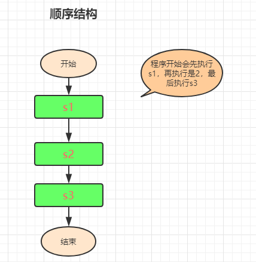

<h1 align="center">day02</h1>
### 一、第二天学习概要:

1、 逻辑运算符

2、 流程控制的三大结构

3、 三元运算符（三目运算符）

练习: 用JS计算下列算式，并将结果在控制台输出？


### 二、逻辑运算符

学习逻辑运算符之前，先声明下逻辑运算符的运算结果有两个：true或false

1、&& 逻辑与(也可以叫并且)。如果左右两个操作符都为true，则结果为true，否则，结果为false

 逻辑与，就是两个条件同时满足时，结果为true

2、|| 逻辑或。左右两个条件，只要一个满足，就返回true，否则，就返回false

3、!  取反运算

**练习题:**

```js
var aa = 0&&1;
alert(aa); 
var bb =  1&&0;
alert(bb); 
var cc =  1&&8;
alert(cc);


var a = 1 && 3 && 5;
alert(a); 
var b = 0 && 2 && 4;
alert(b); 
var c = 5 && 0  && 7;
alert(c);

console.log(0||1); 
console.log(1||0); 
console.log(1||3); 
console.log(3||1);


var a = 5 && 0 || 1;
var b = 4 || 0 &&  8; 
var c= 0 || 8 && 9; 
alert(a),alert(b),alert(c);

var a = 4 + 8 && 3; 
var b = 0 && 7 + 1; 
var c = 4 || 3 && 8-1; 
alert(a),alert(b),alert(c);
```


### 三、流程控制三大结构

1、顺序结构



按照程序的书写顺序，一条一条语句执行，不允许跳过任何一条语句


2、选择（条件）结构


在处理实际问题时，只有顺序结构是不够的，经常会遇到一些条件的判断，流程根据条件是否成立有不同的流向。程序根据给定的条件是否成立而选择执行S2操作或S3操作。这种先根据条件做出判断，再决定执行哪一种操作的结构称为分支结构，也称为选择结构

**a、if单分支选择结构：**if条件判断----只判断true，不判断false

```js
语法结构：

if(条件判断，结果只要两个true或false)
{
    条件为true，将执行该代码
}

//说明：

//if是系统关键字，必须全是小写

//()小括号中，是条件判断语句，判断的结果只有可能true或false

//{}大括号中，是条件为true时，将执行的程序代码
```

**例子：**

- 判断婚否?根据isMarried的值，来输出是"未婚"，还是"已婚"。
- 判断两个数字大小并输出结果?


**b、if else双分支选择结构：**

```js
语法结构-----既判断true，又判断false

if(条件判断：结果只有两个true或false)
{
    条件为true，将执行该代码
}else
{
    条件为false，将执行该代码
}

//如果条件为true，则执行第一大括号{}中的代码

//如果条件为false，则执行第二大括号{}中的代码

//其中，if和else都是系统关键字。if表示如果，else表示否则
```

**例子：**

- 根据isMarried的值，来输出是"未婚"，还是"已婚"。
- 判断两个数谁大谁小？先不考虑相等的情况。

  

**c、if else if多分支选择结构：**

```js
语法结构——多条件判断
if(条件1)
{
    代码1
}else if(条件2)
{
    代码2
}else if(条件3)
{
    代码3
}else
{
    如果以上条件都不成立，则执行该代码
}
//注意：虽然有多个条件，但各条件之间是"或"的关系。每时每刻，只能有一个条件成立，不能同时满足多个条件
```

**例子:**

- 根据用户的分数(0-100之间)，给其相应的评语：大于90为优秀，大于等于80为良好，大于等于70为中等，大于等于60为及格，小于60为不及格

- 利用if选择语句判断两个数是否能除尽？10和3,10和5.  

- 利用if选择语句，判断一个人的年龄，是否符合当兵的要求。条件大于等于18，小于等于25.

- 判断用户输入的年份是否为闰年？闰年的条件：1、能被4整除且不能被100整除。能被400整除

  


### 四、三元运算符

```js
语法:

? : 也叫三目运算符

所谓"三元运算符"就是指三个操作数

语法：条件表达式?结果1：结果2

语法：操作数1?操作数2：操作数3

含义：如果条件为true，则执行"结果1"的代码；如果条件为false，则执行"结果2"的代码

其实：三元运算符，就是if else的变形形式
```

**例子:**

- 判断两个数的大小？暂且不考虑相等情况
- 判断一个年份是闰年还是平年?
- 判断一个数是奇数还是偶数?  
- 判断一个数是正数还是负数 ？


### 五、switch多分支结构

描述：根据一个变量的不同取值，来执行不同的代码。

注意事项：case在进行值比较时，是以全等于来比较匹配的

语法结构：

```js
 switch(条件判断)
 {
     case 值：1;
         代码1;
         break;
     case 值：2;
         代码2;
         break;
     case 值：3;
         代码3;
         break;
     default:
         如果以上条件都不满足，则执行该代码
 }

switch、case、break、default都是系统关键字，都必须全小写

switch后的小括号()：小括号内一般是一个变量名，这个变量可能会有不同的值

每个case的值，与变量的值进行对比，如果一致就执行该case后的代码

所以的case都是"或"的关系，每时每刻只有一个case会满足条件
```

**注意点:**

每个case中的代码执行完毕后，必须用break语句结束，结束之后，程序将跳到switch结束大括号后运行。

如果不写break语句的话，下面的所以的case语句都会执行一遍。

**例子:**

- 让用户输入（0-6）判断输出今天是中文的星期几？
-  输入一个月份，输出对应季节12--2 冬季  3--5 春季 6--8夏季  9--11秋季
- 实现一个简单的计算器  	提示：定义三个变量   数字类型转换  功能：+、-、*、/
-  我们来做个周计划，周一、二学习理念知识，周三、四到企业实践，周五总结经验，周六、日休息和娱乐。请根据星期几做出选择，使用Switch语句完成。


### 六、循环结构

根据条件是否成立，重复执行一个相同的语句块顺序：从上朝下执行的代码就是顺序

明天内容，大家事先预习

**思考题：**

怎样用JS输出一个三行三列的表格？考虑使用循环做

while循环

do whilie循环

for循环

