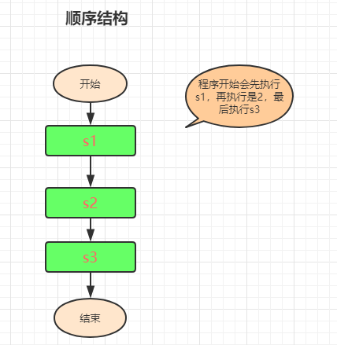

<h1 align="center">day03</h1>
### 一、第三天学习概要:

1、 循环的概念

2、 循环的三要素

3、 循环的分类

### 二、循环

**1、循环的概念:**

- 循环就是重复做一件(每天上课)
- 循环结构是程序中一种很重要的结构，其特点是在给定条件成立时，反复执行某程序段，直到条件不成立为止。 

如：求若干个数之和； （重复做加法）

求某个班全部学生的总成绩；（重复做加法）


**2、循环三要素:**

- 从哪里开始(循环起点) 
- 到哪里结束(循环的结束条件) 
- 步长（步进） （使循环技术增加或减少，趋近于结束条件）


### 三、while循环

```js
语法：
while(条件判断)
{
	如果条件为true，则执行循环体代码
}
```

例子：输出1-10之间的所有的数？

**注意点：**

1、在循环开始前，必须对变量初始化（声明变量，给变量给个初始值）

2、如果while的条件为true，则会重复不断的执行循环体中的（{}）的代码，如果条件为false，则退出循环。

3、在循环体中，必须有“变量更新”的语句。换句话说，两次循环的变量值不能一样，如果一样，会造成死循环。


**练习：**

- 输出1000次，一定要完成作业？思考如何让其他倒叙排列？
- 输出1-100之间的偶数？并求出偶数的和？
- 输出一个3行5列的表格？
- 求1-10之间的奇数？
- 求5的阶乘？
-  打印100以内7的倍数？
- 输出1000-2000之间的所有闰年? 
- 输出456-789的所有可以被2，3，4整除的数值?  


### 四、do while循环

```js
语法格式：

//表达式1：从哪里开始
表达式1;    
do
{  
    //当我们满足循环时要执行的语句
    语句组; 
    //步长（步进）
    表达式3; 
    
 //到哪里结束（循环条件） 
}while()表达式2： 

```

**注意点：**

循环体中，应有结束循环的条件，否则会造成死循环。do while循环是先斩后奏类型的循环体，简而言之就是无论成立与否都会执行一次 

**例子：**

- 计算1+2+3+……+100之和?
- 用do while循环，完成输出100个helloworld？并把字体颜色改为红色。


**while和do while的区别:**

- while是先判断条件，后执行语句，do while是先执行语句，后判断条件 先斩后奏，先执行一次


### 五、for循环

```js
语法：

for(变量初始化; 条件判断； 变量更新)
{
    循环体代码
}
```

例子：输出1-10之间的所有的数？


**for循环执行顺序：**

```js
1、var i=1；变量初始化，在循环开始前执行一次，以后永远不再执行了。

2、i<=10;条件判断。如果条件为true，则重复执行循环体代码；否则，退出循环。你需要循环多少遍，条件就需要多少次判断。

3、执行循环体代码。循环体代码执行完毕后，程序立即跳到"变量更新"模块执行。document.write(i+" ");

4、i++；变量更新。为了避免出现死循环。i++执行完毕后，程序跳到i<=10条件判断语

句，开始第二次循环。
```

**练习：**

1、例子：求1-100之间所有偶数的和？


**break语句:**

描述：

- break语句，用于无条件结束各种循环和switch。

- 说明：一般情况下，需要在break语句之前加一个条件判断。换句话说：就是条件成立了，就退出循环。

- break只能跳出单层循环，不能一次跳出多重循环。

  

2、例子：输出1-100之间所有的数，超过50的不再输出。

```js
for(var i=1; i<=100; i++)
{   
	 //超过50的不再要
	if(i==50)
	{
		break; //跳出循环，跳到for的大括号之后了。break之后的所以语句终止执行
        
				//break只能跳出单层循环，不能一次跳出多重循环
	 }
	document.write(i+" ");
}
```

**continue语句：**

描述：结束本次循环，而开始下次循环。

说明：一般情况下，需要在continue语句之前加一个条件判断。

**循环对比：**

1、for循环和while循环语法规则略有不同，两种方法可以替换使用，但是在部分问题上各有优势

2、for循环一般用于循环次数确定的情况下

3、while一般用于循环次数不确定的情况下

例子：猜数字游戏，谜底：50

```js
//用户可以猜5次  ,若用户猜的小于50，提示：猜小了；否则提示猜大了；猜中了，提示：中奖了(不能继续猜谜)
var i=1;
while(i<=5){
    var num=prompt('请输入谜底');
    if(num<50){
        alert('猜小了!');
    }else if(num>50){
        alert('猜大了!');
    }else{
        alert('猜中了!');
        break;
    }
    i++;
}

//不限定用户猜测次数，若用户猜的小于50，提示：猜小了；否则提示猜大了；猜中了，提示：中奖了(不能继续猜谜)
while(true){
    var num=prompt('请输入谜底');
    if(num<50){
        alert('猜小了!');
    }else if(num>50){
        alert('猜大了!');
    }else{
        alert('猜中了!');
        break;
}
```

注意点：当循环的次数确定时，使用for循环和while循环差别不大，但是当循环次数不确定时，while方法使用起来更加方便，更加好理解。


**练习：**

1、输出1-100之间所有的偶数，用continue做。

 

2、九九乘法表




3、 用for循环打印出好友列表？

```html
好友列表1
    好友1
    好友2
    好友3
好友列表2
    好友1
    好友2
    好友3
```


4、用for循环打印出 金字塔

```
*****
*****
*****
*****
*****

    *
   **
  ***
 ****
*****

规律：空格数 = 总行数 - 每一行星星的个数  5 - i
```


**作业:**

```html
1、入职薪水10K，每年涨幅5%，50年后工资多少？ 
0.05
第一年工资：10000
第二年工资：10000 + 10000*0.05
第三年工资：10000 + 10000*0.05 + (10000 + 10000*0.05)*0.05

salary *= (1+0.05)   salary = salary + salary*0.05

2、五个小朋友排成一队。问第一个多大了，第一个说比第二个大两岁，问第二个，第二个说比第 三个大两岁，以此类推。问第五个小朋友几岁了，第五个小朋友说3岁了。问第一个小朋友几岁?

```

预习: 函数  定义 返回值  有什么作用

